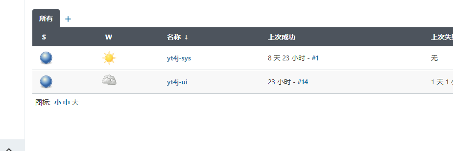
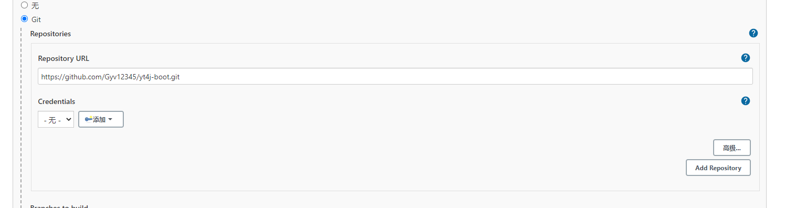
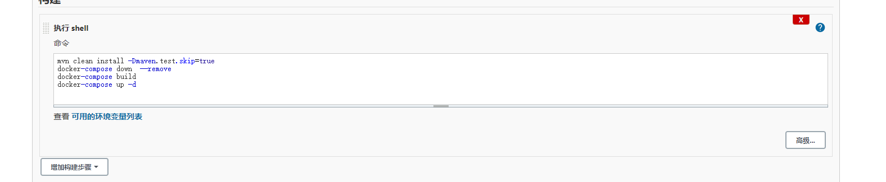
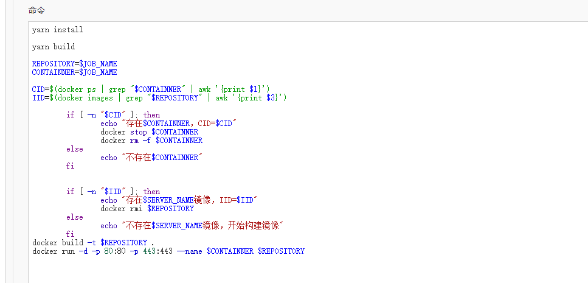

# 使用jenkins和docker来进行部署
## 编辑jenkins镜像
yt4j项目需要使用maven来进行打包spring boot项目，也需要nodejs来对前端进行操作，所以我比较习惯使用jenkins作为基础镜像，自己添加maven和node
```
FROM jenkins/jenkins
MAINTAINER shichenyang89
USER root
RUN curl -sL https://deb.nodesource.com/setup_14.x | bash -
RUN apt-get install -y nodejs
RUN curl -sL https://dl.yarnpkg.com/debian/pubkey.gpg | apt-key add -
RUN echo "deb https://dl.yarnpkg.com/debian/ stable main" | tee /etc/apt/sources.list.d/yarn.list
RUN apt-get update && apt-get install yarn
RUN yarn config set registry https://registry.npm.taobao.org
ADD apache-maven-3.6.3-bin.tar.gz /opt
COPY settings.xml /opt/apache-maven-3.6.3/conf
ENV PATH /opt/apache-maven-3.6.3/bin:$PATH
```

## 打包镜像
```
docker build -t jenkins-master:1.0 .
```

## 启动jenkins
```
docker run -u root -itd -p 8080:8080 -p 50000:50000 \
--restart=always \
-v /var/jenkins_home:/var/jenkins_home \
-v /var/run/docker.sock:/var/run/docker.sock \
-v /usr/bin/docker:/usr/bin/docker \
-v /usr/local/bin/docker-compose:/usr/local/bin/docker-compose \
--name jenkins-master jenkins-master:1.0
```
## 登录jenkins
第一次登录的时候，会让你输入密码，这个密码可以通过cat命令来进行查找

之后就是安装插件了，建议使用推荐插件，全安装了就好，如果这一步被跳过了，估计是因为测试代理使用www.google.com的原因，可以通过进入到容器内部进行修改的方式来解决


## 创建自由风格job

下来就是创建job了，选择自由风格就行了 ，也就是第一个














## 启动脚本

yt4j-sys

~~~shell
mvn clean install -Dmaven.test.skip=true
docker-compose down  --remove
docker-compose build
docker-compose up -d
~~~


yt4j-ui

~~~shell
yarn install

yarn build

REPOSITORY=$JOB_NAME
CONTAINNER=$JOB_NAME

CID=$(docker ps | grep "$CONTAINNER" | awk '{print $1}')
IID=$(docker images | grep "$REPOSITORY" | awk '{print $3}')

        if [ -n "$CID" ]; then
                echo "存在$CONTAINNER，CID=$CID"
                docker stop $CONTAINNER
                docker rm -f $CONTAINNER
        else
                echo "不存在$CONTAINNER"
        fi


        if [ -n "$IID" ]; then
                echo "存在$SERVER_NAME镜像，IID=$IID"
                docker rmi $REPOSITORY
        else
                echo "不存在$SERVER_NAME镜像，开始构建镜像"
        fi
docker build -t $REPOSITORY .
docker run -d -p 80:80 -p 443:443 --name $CONTAINNER $REPOSITORY
~~~
