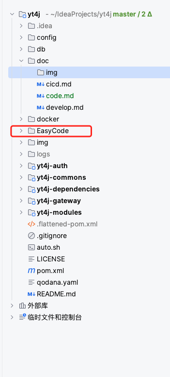
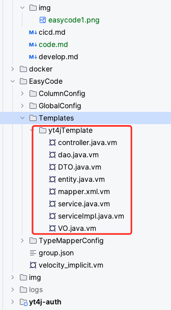

## 代码生成
easycode这个插件，因为很长时间没有更新了，所以yt4j使用一个fork的插件，EasyCode-MybatisCodeHelper

EasyCode-MybatisCodeHelper 增加了一种新的模板放置方式，早前的版本模板文件是放在临时文件和控制台那里的，现在可以直接在项目中进行设置了

### 修改模板

通过在项目中修改模板文件，你可以生成自己想要的代码，一些模板引擎的操作方式，EasyCode-MybatisCodeHelper 是有介绍

通过添加修改这些模板可以实现我们想要实现的代码

